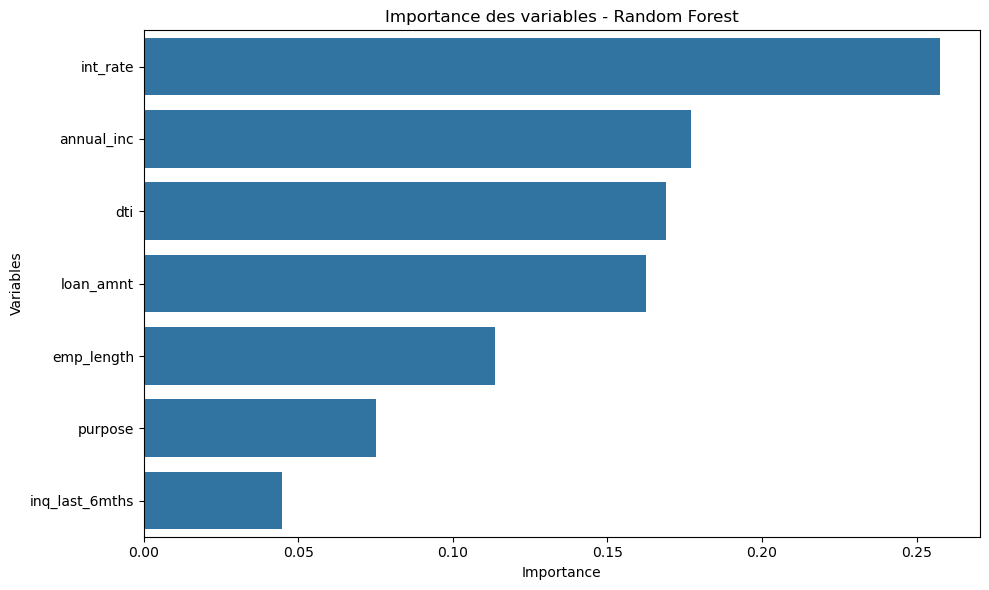

#  Prédiction de Défaut de Crédit

## 🎯 Objectif du projet

Ce projet consiste à développer une application Streamlit permettant de prédire si un emprunteur est susceptible de faire défaut sur un prêt, en se basant sur des données financières.

Ce travail a été réalisé dans le cadre d'un **projet  universitaire**, où l'objectif est de créer une **WebApp locale fonctionnelle** s'appuyant sur un **modèle de machine learning **.

---

## 🧠 Données utilisées

Les données proviennent du dataset public (extrait Kaggle) :LendingClub (https://www.kaggle.com/datasets/wordsforthewise/lending-club)
Nous avons filtré uniquement les prêts ayant un statut clair :  
- `Fully Paid` → **Pas de défaut**
- `Charged Off` / `Default` → **Défaut**
-
---

##  Variables utilisées

Les variables sélectionnées ont été choisies suite à une analyse de corrélation :

- `loan_amnt` : montant du prêt
- `int_rate` : taux d'intérêt
- `emp_length` : ancienneté professionnelle
- `annual_inc` : revenu annuel
- `purpose` : objet du prêt
- `inq_last_6mths` : demandes de crédit récentes
- `dti` : taux d’endettement (calculé dans l’app)


---

## ⚙️ Modèle de Machine Learning

- **Type** : `RandomForestClassifier`
- **Prétraitement** :
  - Encodage des catégories : `LabelEncoder`
  - Standardisation : `StandardScaler`
  - Rééquilibrage : `SMOTE`
-**Évaluation** : Classification report + importance des variables
    loan_amnt → Min : 500.00 | Max : 35000.00
    int_rate → Min : 5.32 | Max : 28.99
    annual_inc → Min : 3000.00 | Max : 8706582.00
    dti → Min : 0.00 | Max : 57.14
-**Performances** :
  - Précision : 85%
  - Rappel : 86%
  - F1-score : 86%

---

## 💻 Application Streamlit

### Fonctionnalités :
- Interface utilisateur simple
- Formulaire interactif
- Calcul automatique du DTI
- Prédiction du risque (score + couleur)
- Visualisation graphique du score

---

## 🚀 Comment lancer le projet


### 1. Installer les dépendances
```bash
pip install -r requirements.txt
```

### 2. Lancer l’application localement
```bash
streamlit run app.py
```

---

## ## 🗂 Structure du Dépôt

├── app.py                      # Application Streamlit
├── exploration_corr.py         # Analyse de corrélation et sélection des variables
├── loan.csv                    # Données brutes
├── requirements.txt            # Dépendances Python
├── README.md                   # Ce fichier
└── models/
    ├── credit_model_rf_smote.pkl
    ├── label_encoders_rf_smote.pkl
    ├── scaler_rf_smote.pkl
    └── feature_order.pkl
```


```

---

## 👥 Auteurs

- Djamal Eddine B.HASSANI
-
-
- Projet Python - Université [anné2025]
-Prof :Alexis Bogroff

---

## 🤖 Utilisation de ChatGPT

Le code a été conçu et structuré avec l’aide de **ChatGPT**.

